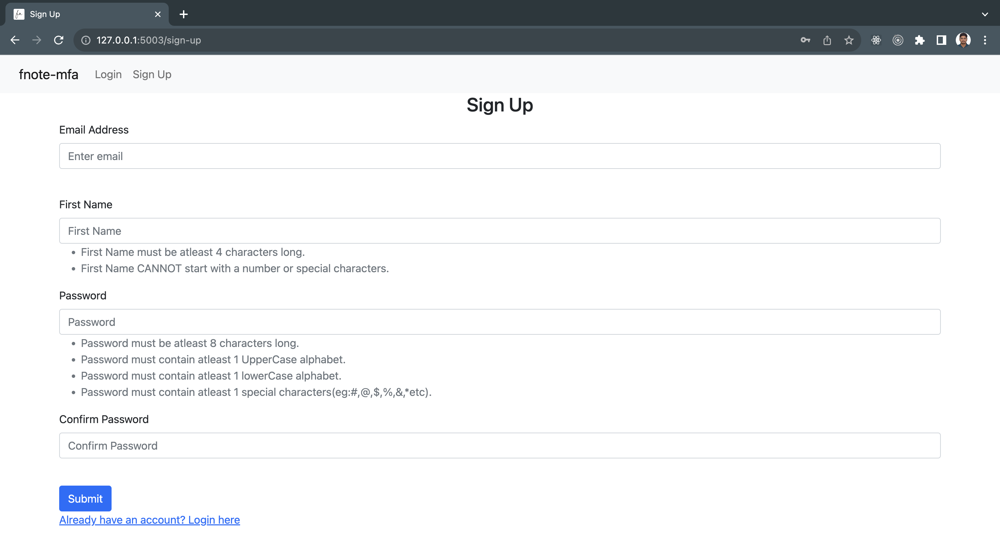
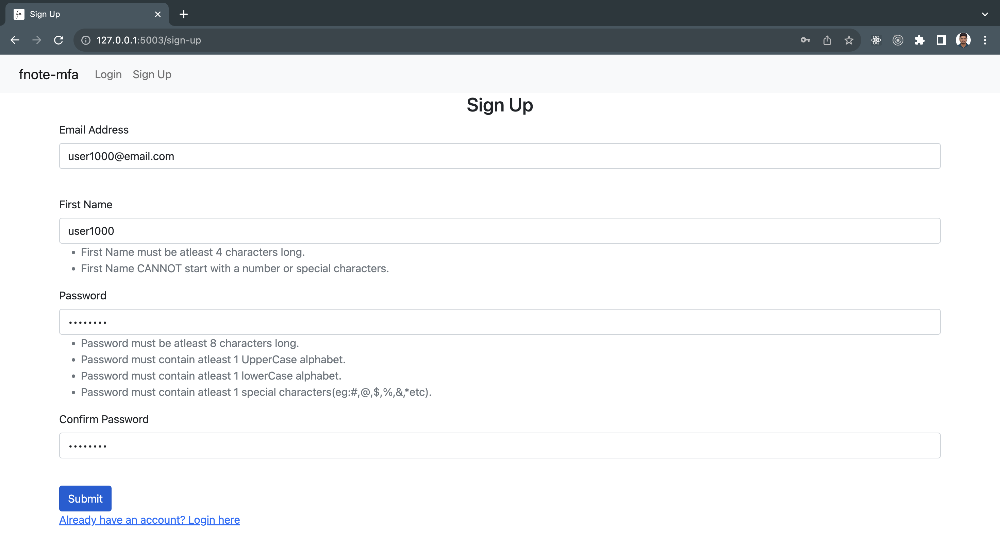
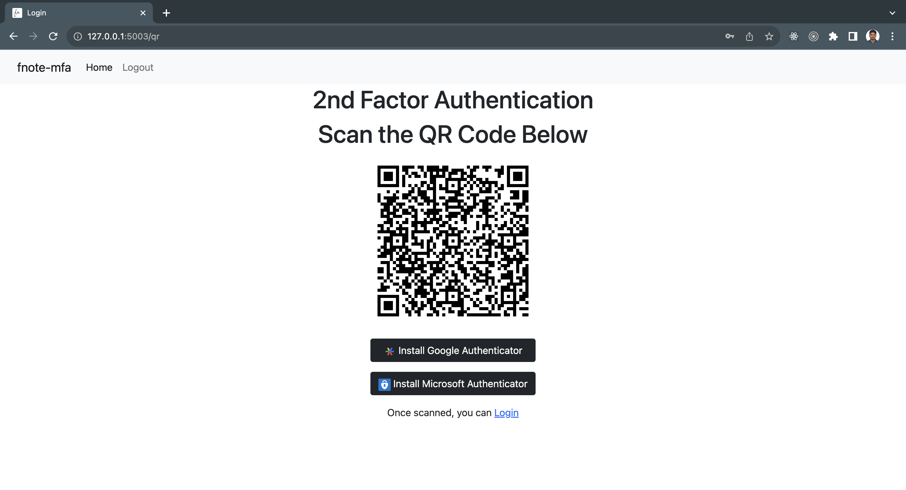
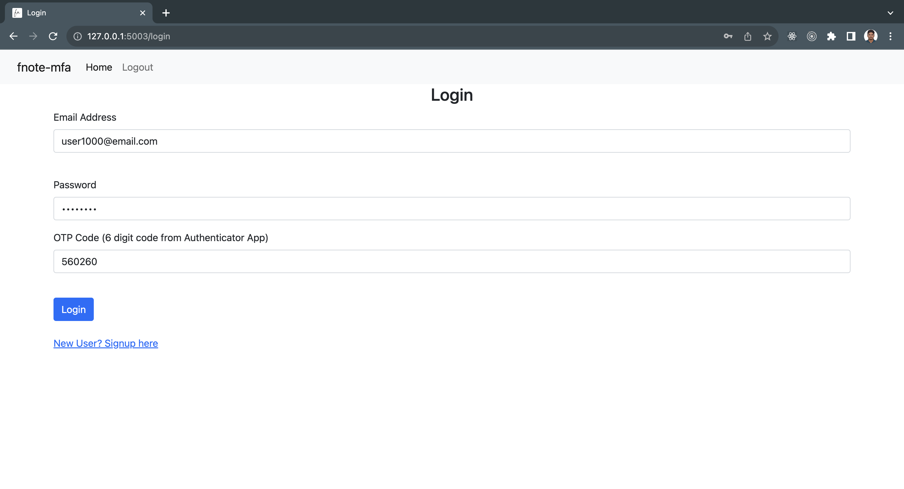
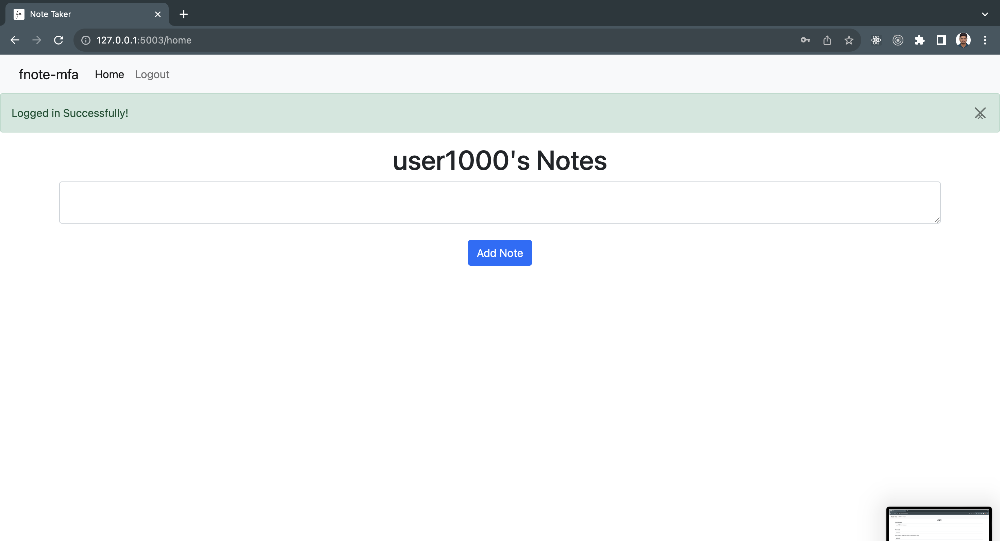

# fnote-mfa

Minimal Note Taking App with Multi-factor Autentication enabled

# To run locally 

1. Clone this repo 

2. Create a virtual environment and install the dependent packages

```
# virtualenv venv

# source venv/bin/activate

# pip3 install -r requirements.txt

# python3 main.py
```

## Sample images











## Functionalities

- Create a new user (Signup)
- Multi-factor Authentication (Using TOPT)
- Login only for signed up user (Login and Logouts)
- Create notes (NOT shared notes, each user can only see his notes)
- Delete notes (Only registerd users can delete/create notes)
- Cannot see other users notes
